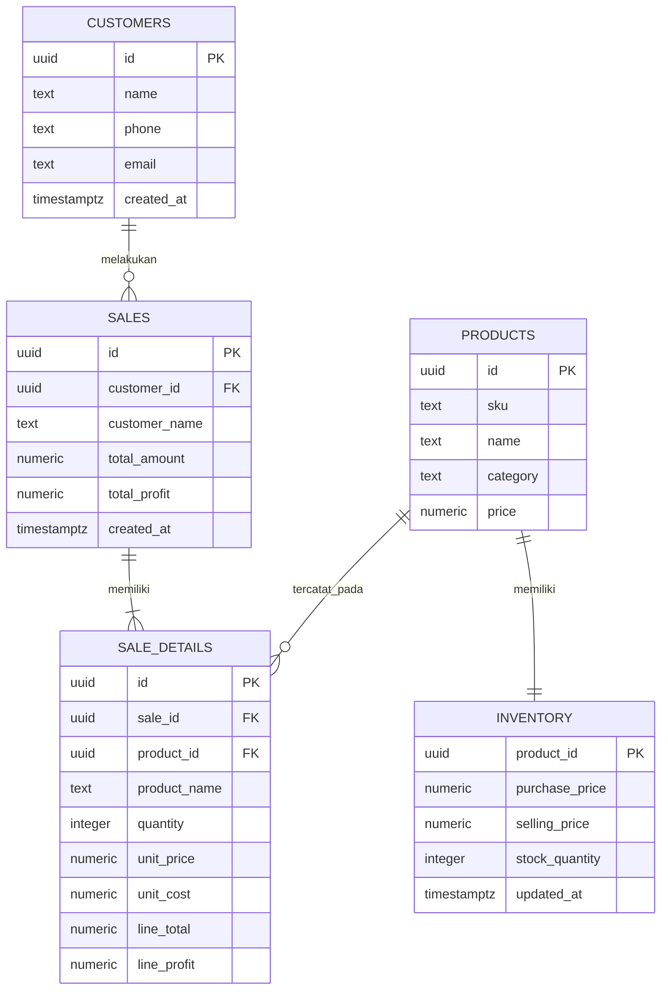

# Teman Bulu - Sistem Penjualan Pet Shop

Aplikasi kasir ringan untuk pet shop dengan frontend HTML/CSS/JavaScript statis dan Supabase Postgres. Tidak menggunakan Node.js, package.json, atau file environment lokal.

## Struktur

```text
frontend/
  index.html
  styles.css
  app.js
backend/
  schema.sql
  app.js
README.md
```

## ERD (5 entitas)



    `line_total` dan `line_profit` pada detail dihitung oleh kolom generated. Trigger mengakumulasi keduanya ke total penjualan. Harga beli disalin ke detail saat transaksi, sehingga perubahan harga modal produk tidak mengubah profit historis. Profit yang ditampilkan adalah profit kotor (`harga jual - harga beli`), belum dikurangi biaya operasional. Penjualan lama yang belum memiliki snapshot modal menampilkan profit sebagai belum dihitung.

## Menjalankan

1. Buka **SQL Editor** di project Supabase dan jalankan seluruh isi `backend/schema.sql` (jalankan ulang untuk memigrasikan project yang sudah memakai versi sebelumnya). Sepuluh produk awal beserta harga jualnya akan masuk ke katalog.
2. Produk awal mendapat stok contoh beragam: Meow Mix (18), Royal Canin Kitten (0), Pedigree (4), Treat Salmon (26), Dental Chew (2), Pasir Tofu (0), Shampoo (11), Kalung Kucing (3), Bola Interaktif (32), dan Tali Anjing (6). Harga beli awal adalah estimasi 70% harga jual. Saat migrasi, stok nonnol yang sudah ada dipertahankan; stok nol SKU contoh disesuaikan satu kali. Verifikasi harga modal dan stok aktual lewat tombol **Atur** sebelum transaksi.
3. Project URL dan publishable key project sudah diisikan pada `defaultSupabaseConfig` di `frontend/app.js`. Ganti nilainya jika memakai project lain; kunci ini memang bersifat publik dan harus dibatasi dengan RLS.
4. Buka `frontend/index.html` di browser. Aplikasi memanggil Supabase REST API langsung, tanpa Node.js, server lokal, atau Edge Function. Jika perlu, ubah koneksi melalui **Pengaturan Supabase**; pengaturan tersebut disimpan di local storage browser.
5. Gunakan menu Ringkasan untuk membuat transaksi; Pelanggan dan Produk untuk mengelola data; Penjualan untuk melihat riwayat dan profit.

`backend/app.js` adalah opsi Edge Function berbasis Deno untuk deployment API terpisah, bukan prasyarat bagi frontend saat ini.

## Katalog awal

| Produk | Harga jual | Stok awal |
| --- | ---: | ---: |
| Meow Mix Adult 1kg | Rp68.000 | 18 |
| Royal Canin Kitten 400g | Rp92.000 | 0 |
| Pedigree Adult 1kg | Rp57.000 | 4 |
| Treat Salmon Bites 60g | Rp28.500 | 26 |
| Dental Chew Medium 3pcs | Rp32.000 | 2 |
| Pasir Tofu Green Tea 6L | Rp48.000 | 0 |
| Shampoo Pet Gentle 250ml | Rp39.500 | 11 |
| Kalung Kucing Bell | Rp24.500 | 3 |
| Mainan Bola Interaktif | Rp35.000 | 32 |
| Tali Anjing Nylon 1.5m | Rp62.000 | 6 |

## Catatan keamanan

Skema awal memberi role `anon` akses CRUD agar aplikasi toko sederhana bisa langsung dipakai tanpa alur login. Artinya siapa pun yang mengetahui URL project dapat membaca atau mengubah data melalui API publik. Sebelum dipakai di internet/produksi, batasi policy RLS dan tambahkan Supabase Auth; jangan pernah menaruh service role key di frontend. Edge Function opsional hanya meneruskan operasi dengan hak akses anon.
